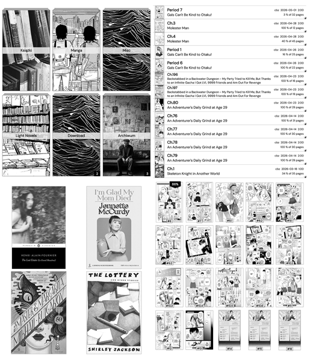

# FolderMemory.koplugin

A KOReader plugin that remembers per-folder settings and restores them automatically when you return to a folder.

 

<picture>

</picture>

## What it does

When you navigate into a folder, **FolderMemory** remembers and restores:

- **Sort order** (by name, date, size, etc.)
- **Reverse sort** direction
- **Folders and files mixed** toggle
- **Book status filter** (new, reading, abandoned, complete, or any combination)
- **Display mode**: classic (filenames only), mosaic (cover images or text covers), detailed list (with images, metadata, or filenames)
- **Items per page**: mosaic grid columns × rows (portrait and landscape), list mode files per page, and classic mode items per page. **Configure this folder** only offers the entries that apply to the current display mode and to the orientation the device is held in; **Configure default settings** always lists them all, since the template describes folders as they may be later

### Inheritance from parent folders
If a folder has no saved settings of its own, the plugin walks up the directory tree and uses the nearest ancestor's settings. If none is found, it falls back to a global default template you can configure.

This means you can save settings once on `Books/` and all subfolders (`Books/Fantasy/`, `Books/Sci-Fi/`, etc.) will inherit them — unless you override a specific folder. When inheritance is disabled, every folder without its own settings goes directly to the default template.

### Default template

A global `__default__` template is auto-created from your current KOReader settings on first install. You can edit it anytime via the plugin menu without affecting your current folder — it serves as a fallback for folders without their own saved settings and for virtual views (History, Favorites, Collections).

## How it works

- **Auto-save** — any change you make to sort, display mode, grid, or book status filter via KOReader's native menus or the Folder Memory menu is automatically captured and saved for the current folder.
- **Seamless restore** — settings are applied automatically when entering a folder
- **No global side effects** — items per page (including classic mode) and the mosaic grid are remembered per folder without touching KOReader's global settings. Collections, OPDS, History and search results keep their own values instead of inheriting the settings of the last folder you visited.

## Installation

Copy the `foldermemory.koplugin` folder to `koreader/plugins/` and restart KOReader.

## Usage

From the file browser, open the menu (top-left) → **Folder memory**:

| Menu item | Description |
|-----------|-------------|
| **Configure this folder** | Open a settings window for the current folder: sort, display mode, items per page, and book status filter. Changes are saved automatically and applied immediately. The Dispatcher action below opens the same window. |
| **Clear saved settings for this folder** | Remove the current folder's saved settings — it will inherit from parent folders or fall back to defaults. |
| **Inherit settings from parent folders** | Toggle inheritance on/off. When off, folders without their own settings skip ancestors and go directly to the default template. |
| **Configure default settings** | Edit the `__default__` template. These changes never affect your current folder — they only define the fallback for unconfigured folders and virtual views. |
| **Clear all saved folder settings** | Remove all per-folder memory. The default template is preserved. |

### Gesture shortcut

**Configure this folder** is also registered as a Dispatcher action, so you can bind it to a gesture: *Settings → Taps and gestures → Gesture manager*, pick a gesture, then choose **File browser → Folder memory: configure this folder**. The gesture opens a settings window for the folder you are currently browsing — no need to go through the menu. Settings with several choices (sort order, book status, display mode) open a second window listing them.

## Compatibility

Tested on KOReader 2026.03 "Snowflake" and nightly. Should work on any recent version. Requires CoverBrowser plugin for display mode and grid features (the plugin gracefully degrades if CoverBrowser is not installed).

#### My [User Patches](https://github.com/Craftwork2720/koreader-patches) for KOReader. ❤️